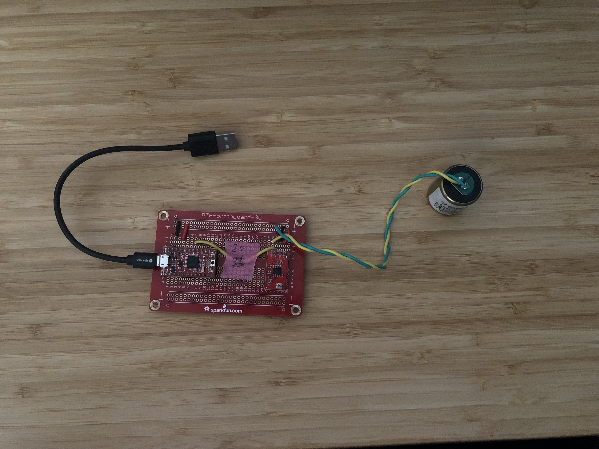

# Gait Monitoring WebApp Visualization Tool
## Pervasive Autonomous Networked Systems (PANS) Lab 
Submitted by: **Francisco Lira** and **Melody Hu**

**Gait Monitoring Website Visualization** is a data visualization tool that assists in visualizing and understanding the current research project. 

## Summary Of Overall Project

For fall-risk assessment of older adults, long-term non-intrusive gait monitoring at home is crucial. Due to floor vibration-based system’s need for dense deployment, we propose to install structural vibration sensors on robot vacuum cleaners that would be able to collect data from around the house. In order to validate our system, we conduct experiments that compare signals acquired from sensors on floor and sensors on robot.

Time spent: Summer 2021 (June - August)

Each sensor node contains two parts: the signal amplifier, sampling part, and data collection and saving part. This tutorial introduces how to build the sensor unit from the independent modules to a functional sensor unit.

## Hardware modules information
Module information.
| Name | Type |Number | Link|
|-----|-----|-----|-----|
|Geophone | SM-24 |1| [sparkfun link](https://www.sparkfun.com/products/11744) |
|Amplifier | SparkFun OpAmp Breakout - LMV358 |1| [sparkfun link](https://www.sparkfun.com/products/9816) |
|Arduino | SparkFun SAMD21 Mini Breakout |1| [sparkfun link](https://www.sparkfun.com/products/13664) |
|Rasbperry Pi| Raspberry Pi 3 B+ |1| [sparkfun link](https://www.sparkfun.com/products/14643)

Besides these modules on the above table, you also need solder, an extend empty board to hold all the module, some suitable jump wire, some [headers](https://www.sparkfun.com/products/116), a Micro-usb wire.

## Hardware connection




This figure showed the connection between the Arduino, Geophone, and Amplifier. The red wire represents the 3.3V power supply. The black wire represents the GND. The blue and green wires represent the signal from the Geophone, one connects to the GND, and the other one as the input of the Amplifier module. The yellow wire represents the output of the Amplifier and as the input of the Adruino board ADC pin.

Using the Micro-USB wire to connect the Arduino board and the Raspberry Pi. That's all the soldering and connection work.

## Software deployment

### Visualization tool Setup
The repository of the visualization code can be found [here](https://github.com/frankie-lira/Gait-Monitoring-Website)

Run the code in your IDE of choosing (Recommend Visual Studio Code) and make sure that it runs locally. 

### Arduino 
The setup guide for Arduino Zero can be found [here](https://learn.sparkfun.com/tutorials/samd21-minidev-breakout-hookup-guide/setting-up-arduino)

To flush the code, you need to install the Arduino Zero from board manager. Then follow the guidance [here](https://learn.sparkfun.com/tutorials/samd21-minidev-breakout-hookup-guide/setting-up-arduino). Make sure select SparkFun SAMD21 Mini Breakout as the board when flush.

The code that was flushed to the arduino can be found [here](https://github.com/frankie-lira/Gait-Monitoring-Website/tree/master/Arduino)

### Raspberry Pi

#### Raspberry Pi Server Set Up
Download websockets on the Raspberry Pi:
```bash
pip3 install websocket-client
```

In the built-in python IDE in the Raspberry pi, write the code for the server. The code that was used to create the server can be found [here](https://github.com/frankie-lira/Gait-Monitoring-Website/tree/master/raspberry%20pi)

### Computer

#### Computer (that the WebApp runs on) Set Up
Install Plotly (make sure it is version 5.2.1):
```bash
pip install plotly==5.2.1
```

## Limitations
* We set up the Raspberry Pi as the server and the computer hosting the WebApp is the client. There are some limitations to this set up, with one main problem being that the user would have to manually enter the Raspberry Pi IP address on the server script and the client script.
* While the plotting tool works, the graph looks really cramped after leaving the WebApp to run for a while. This could be fixed by zooming in on certain parts of the graph or making the x-axis automatically change the layout every time interval.

## Video Walkthrough
Here's a walkthrough of implemented user stories:


## Instruction for how to use

1. plug in Arduino board into Raspberry Pi
2. run the server.py script on the Raspberry Pi
3. open index.html locally or host a HTTP server (more infor found [here](https://developer.mozilla.org/en-US/docs/Learn/Common_questions/set_up_a_local_testing_server))
